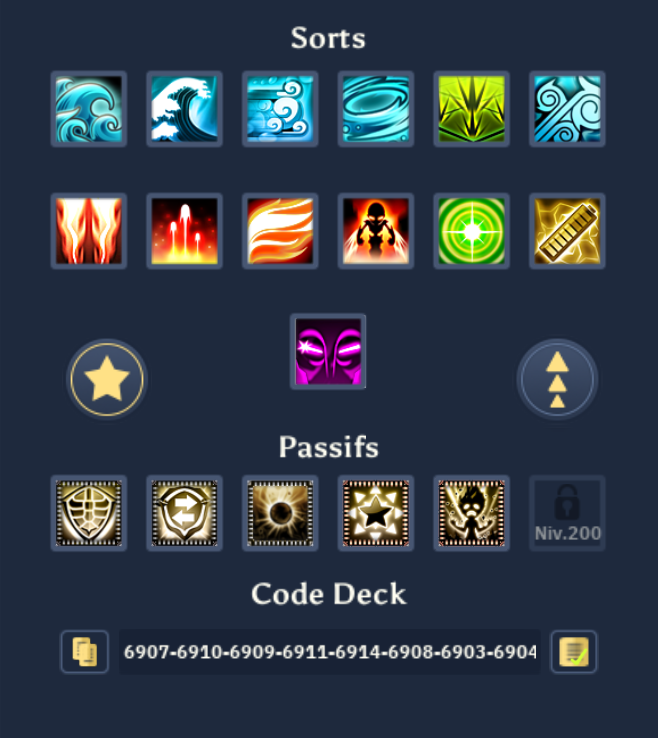
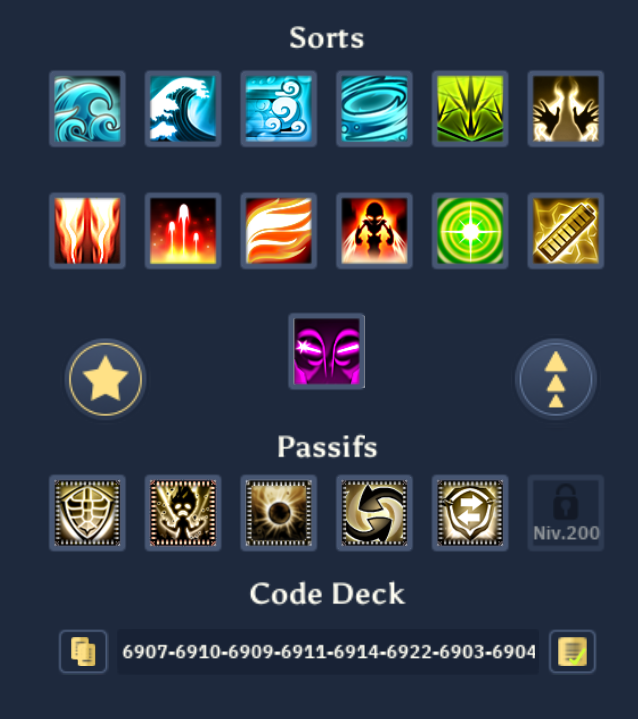
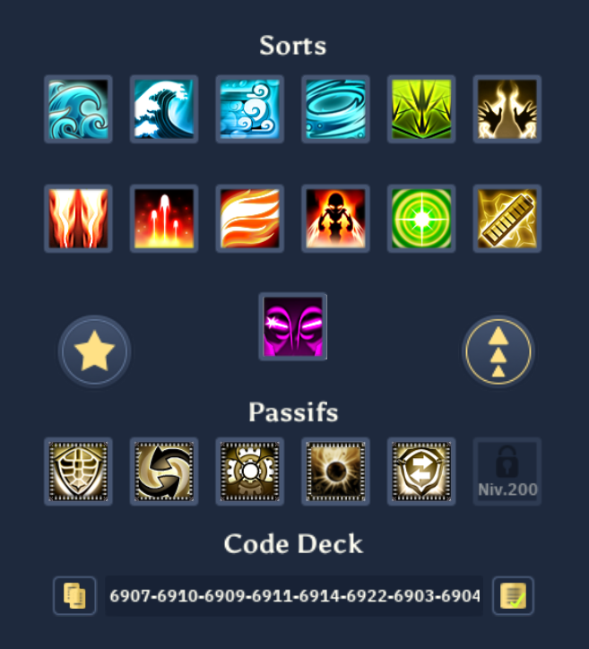
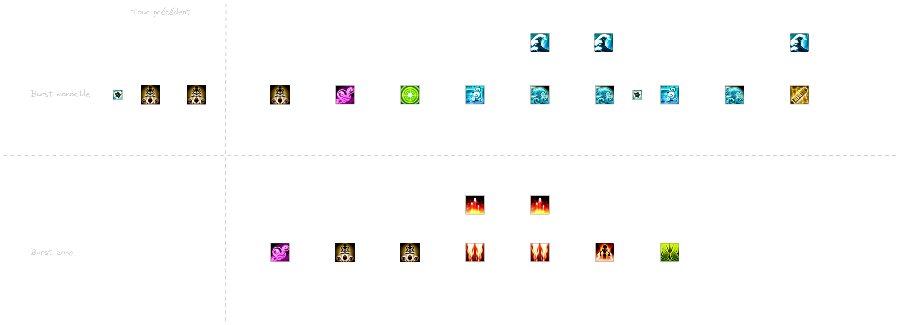
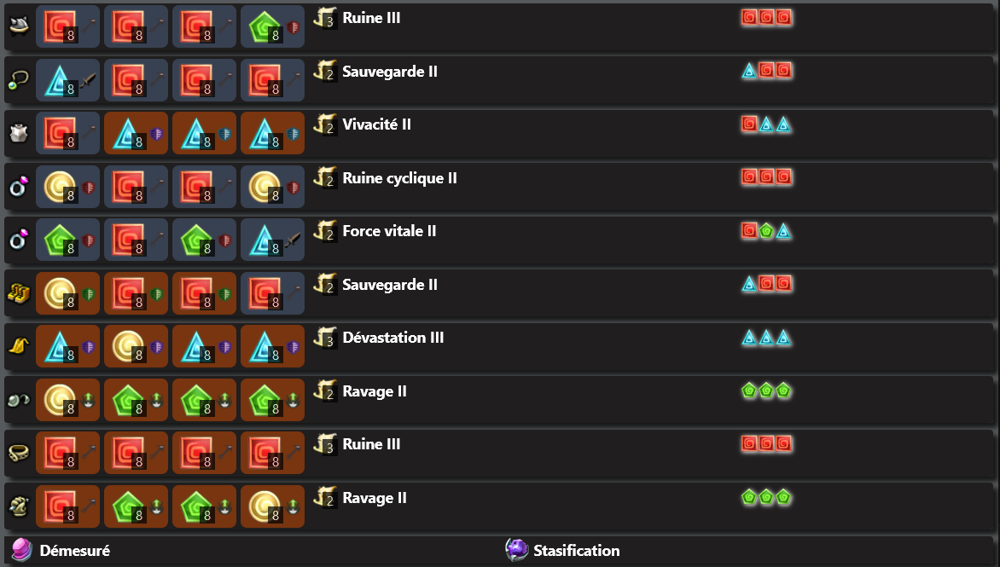

### Description

Steamer dpt distance:
- critique;
- indirect;
- versatile.

### Objectifs

- Jouer haut - moyen - bas PW/PS.
- Burst qui scale avec la qualité du setup du tour: positionnement des tourelles, du steamer et des mates.
- En S4:
	- One turn des mobs en zone.
	- One turn des boss ayant l'invulnérabilité bypassable.
- Peut dpt tous les tours ou bien 1/2.

### Prérequis

- Build relativement couteux: il est fait pour ceux qui souhaitent investir dans le classe.
- 14 PA

### Deck

#### Salle - OT un monstre

Ce deck permet au steamer de faire le combo Choc + Filbuste x 2 + Dissolution sur un monstres, cela a généralement pour effet de le one turn. Très utile dans les salles de donjons dans lesquelles le steamer se voudrais monocible.

**6907-6910-6909-6911-6914-6908-6903-6904-6905-6906-6916-6918-6941-6932-6938-5237-5144-0**

#### Distance, 1 tourelle

C'est le premier deck utilisable aussi en salle de boss.
- Technologie des transports peu remplacer exécution immédiate.
- En fonction de la stratégie, vous pourrez vous passer de transfert brutal.
Dans les 2 cas précédent, le deal serait d'échanger la capacité de burst contre plus de mobilité.

**6907-6910-6909-6911-6914-6922-6903-6904-6905-6906-6916-6918-6941-5144-6938-6935-6932-0**

#### Distance, 2 tourelles

Je déconseille cette configuration aux amateurs, car elle implique une grosse charge mentale en terme de positionnement du steamer et de ses tourelles, même si elle produit un burst énormissime si le tour est correctement préparer.
En outre, remplacer exécution immédiate par carnage, et profiter du steamerator en permanence est un excellent mode de jeu, surtout lorsque la situation nous impose d'attaquer avec les sorts monocibles.

**6907-6910-6909-6911-6914-6922-6903-6904-6905-6906-6916-6918-6941-6935-6943-6938-6932-0**

### Combos

Il n'y a que 2 gros combos à connaître, car ils sont optimisés pour le gameplay 14 PA.

### Sublimations

### Considérations importantes

- Avec des ruines, le combo (Fourant x 2) + Ecume, inflige plus de dégâts que choc.
	- Cela est encore plus dramatique en mode Cannonier
- Le même combo, avec Flibuste à la place de Courant, inflige aussi plus de dégât qu'un choc.
- Le seul moment où choc est rentable est si le combo génère un reste de 6PA; dans ce cas, il faudra l'hanticiper, et jouer choc en premier, car ses dégâts sont maximisés sur une cible dont les PVs courant valent aux moins 90% des PVs max.
- Sabordage fait moins de dégâts que les 2, avec 1 tourelle au contact de la cible
- Sabordage fait plus de dégâts que choc, avec une tourelle lvl 3 et une tourelle lvl 2 au contact de la cible. C'est compliqué en mettre en oeuvre dans certains fight, mais il faut le garder à l'esprit.
- Transfert brutal est un passif à privilégier en salle de boss, car il a une dimension high risk, high reward, car il amputera votre régénération de PW.
- Il est important de se souvenir des passifs eau et terre de substitution mécanique.
	- Avec le passif eau, être aligné avec ses tourelles ouvre de nouvelles possibilités quant-a la gestion de la tourelle.
	- Le passif terre permet de rapprocher des mobs ayant été positionné à plus de 2PO de la tourelle, en ligne. Ce qui donne au placeur une sorte de marge d'erreur sur quelque mobs.
- Passer en mode canonnier dans le tour de dégâts n'a aucun intérêt, car on perd 2PA sans pour autant faire plus de dégâts.

### Bonus de dégâts supplémentaires

Un moyen de préparer un tour de burst consiste monter en niveau sa ou ses tourelles, et terminer certains tours en mode feu pour avec le bonus de dégât du transfert brutal.

En mode feu, et avec 2 mobs en LDV de chaque tourelles:
-  Avec 10PS max (12 - 2), transfert brutal donne 40% de dégâts supplémentaires, avec 1 tourelle lvl 3.
- Réciproquement, avec 10PS max, transfert brutal donne:
	- 60% avec 2 tourelles lvl 2.
	- 80% avec 2 tourelles lvl 3.
	- Sachant que mécanique avancée retire 20% de dégâts, cela revient à 40% et 60% de dégâts supplémentaires.
